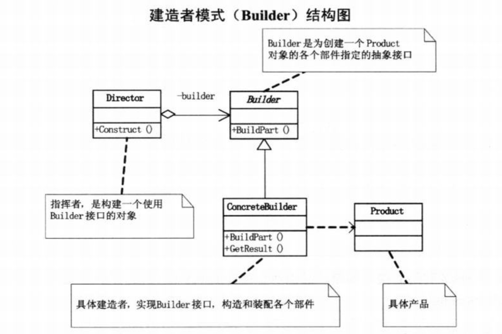

# Builder Pattern

---

**Builds a complex object using simple objects**

The Builder design pattern has been commonly described as the relationship between a director, few Builders, and the product they build.

The Builder design pattern helps us maintain an unpredictable name of products by using a common construction algorithm that is used by the director. The construction process is always abstracted from the user of the product.