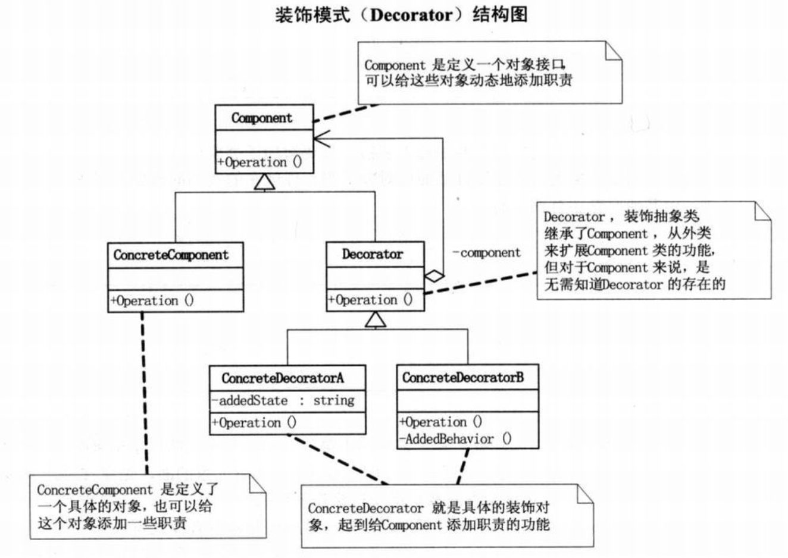

# Decorator Pattern

---

装饰模式使用对象组合的方式动态改变或增加对象行为。

Go语言借助于匿名组合和非入侵式接口可以很方便实现装饰模式。

使用匿名组合，在装饰器中不必显式定义转调原对象方法。

## Decorator versus Proxy

- Decorator Pattern decorate a type at runtime
  - This means the decoration may or may not be there, 
  - or it may be composed of one or many objects.

- Proxy at compile time 

